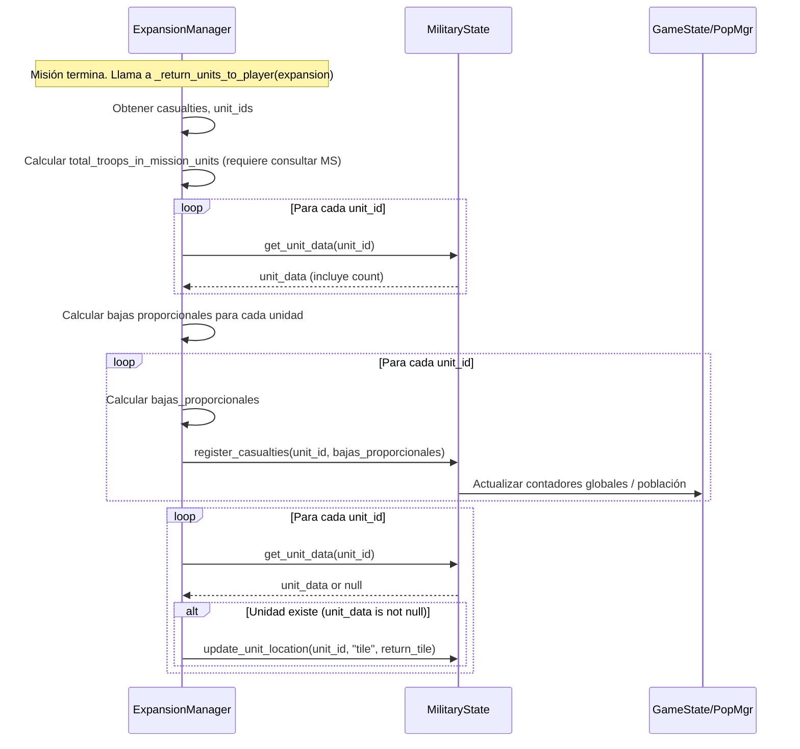

# Plan para Corregir Cálculo de Tropas Post-Misión

## 1. Objetivo

Asegurar que las bajas ocurridas durante las misiones de expansión/ataque se apliquen correctamente al estado global de las tropas (`MilitaryState`) y que las unidades supervivientes regresen al estado "en territorio" (location_type = "tile") al finalizar la misión. Esto corregirá el problema donde las tropas desplegadas y totales no se actualizan correctamente después de una misión.

## 2. Archivo Clave a Modificar

- `scripts/game_logic/expansion_manager.gd`

## 3. Función Clave a Modificar

- `_return_units_to_player(expansion: Dictionary)`

## 4. Pasos Detallados de Implementación

La lógica se implementará dentro de la función `_return_units_to_player`:

1.  **Obtener Datos:** Recuperar las bajas totales acumuladas durante la misión (`expansion.casualties`) y la lista de IDs de las unidades que participaron (`expansion.get("unit_ids", [])`).
2.  **Verificar Bajas:** Si `expansion.casualties > 0` y la lista `unit_ids` no está vacía, proceder a aplicar las bajas.
3.  **Consultar Tamaño Actual:** Iterar sobre `unit_ids`. Para cada `unit_id`, llamar a una nueva función (o método existente si es posible) en `MilitaryState` para obtener el tamaño (`count`) actual de esa unidad. Sumar estos tamaños para obtener el `total_troops_in_mission_units`. (Nota: Esto podría requerir añadir una función como `get_unit_data(unit_id)` o `get_unit_count(unit_id)` a `MilitaryState`).
4.  **Distribuir Bajas (Proporcional):**
    *   Para cada `unit_id`:
        *   Calcular `bajas_proporcionales = round(expansion.casualties * (unit_count / total_troops_in_mission_units))` (asegurarse de manejar división por cero si `total_troops_in_mission_units` es 0).
        *   Asegurarse de que `bajas_proporcionales` no exceda `unit_count`.
        *   Llamar a `MilitaryState.register_casualties(unit_id, bajas_proporcionales)`.
    *   Nota: `MilitaryState.register_casualties` ya se encarga de reducir el `count`, eliminar la unidad si llega a cero y actualizar los contadores globales en `GameState`/`PopulationManager`. Es importante manejar el redondeo y asegurar que la suma total de bajas aplicadas sea igual a `expansion.casualties`.
5.  **Actualizar Ubicación de Supervivientes:** Después de aplicar todas las bajas, iterar nuevamente sobre la lista `unit_ids` original.
    *   Para cada `unit_id`:
        *   Verificar si la unidad todavía existe en `MilitaryState` (podría haber sido eliminada por las bajas). Se puede usar la misma función `get_unit_data(unit_id)` o similar.
        *   Si la unidad existe, llamar a `MilitaryState.update_unit_location(unit_id, "tile", return_tile)` para marcarla como de vuelta en el territorio.

## 5. Diagrama de Secuencia

## 6. Consideraciones Adicionales

- **Nueva Función en `MilitaryState`:** Es probable que se necesite añadir una función a `MilitaryState` para obtener eficientemente los datos (al menos el `count`) de una unidad específica por su ID.
- **Manejo de Redondeo:** Al distribuir bajas proporcionalmente, asegurarse de que la suma total de bajas aplicadas coincida exactamente con `expansion.casualties`. Se puede ajustar la última unidad o la más grande para compensar diferencias de redondeo.